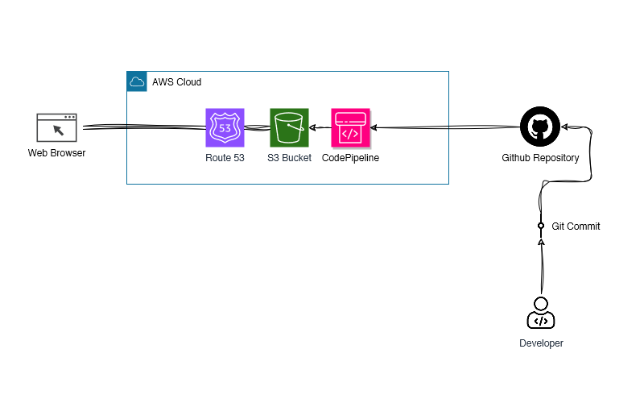

# Static Website Hosting on Amazon S3 with CI/CD Pipeline.
This project demonstrates how to host a static website on Amazon S3 and set up a Continuous Integration/Continuous Deployment (CI/CD) pipeline that automatically deploys changes from a GitHub repository to the S3 bucket whenever updates are pushed.

Visit the website here: [http://kalam-tribute-page.s3-website.ap-south-1.amazonaws.com/](http://kalam-tribute-page.s3-website.ap-south-1.amazonaws.com/)

## Diagram

  

**Step 1: Set Up Your Amazon S3 Hosting**

Begin by creating an Amazon S3 bucket to host your static website content. Configure the S3 bucket for static website hosting. Set the index and error documents as needed.

**Step 2: Create a GitHub Repository**

Create a new GitHub repository or use an existing one to store your static website's source code. Push your website code to this GitHub repository, making sure it's up-to-date.

**Step 3: Set Up AWS CodePipeline**

In the AWS Management Console, navigate to AWS CodePipeline. Create a new pipeline and define your source stage. Connect it to your GitHub repository as the source provider. Add a build stage if necessary, for example, if you need to compile or preprocess your website code. Configure the deployment stage to deploy your website to the S3 bucket you created in Step 1. Use AWS CodeDeploy or the S3 deployment action to perform this.

**Step 4: Configure GitHub Webhooks**

In your GitHub repository settings, set up webhooks to trigger your AWS CodePipeline whenever changes are pushed to the repository. Configure the webhook payload URL to point to your CodePipeline endpoint.

**Step 5: Push Updates and Automate Deployments**

With the webhook in place, any updates you push to your GitHub repository will automatically trigger your AWS CodePipeline, leading to the deployment of your website on S3.

**Step 6 (Optional): Set Up a Custom Domain with Amazon Route 53**

If you want to use a custom domain for your static website, create a hosted zone in Amazon Route 53. Configure Route 53 to point to your S3 bucket as the origin for your custom domain. Update the DNS records for your domain to use the Route 53 name servers or configure DNS records in your domain registrar's dashboard to use Route 53. Verify that your custom domain is properly mapped to your S3-hosted static website.

By following these steps, you'll have successfully set up a CI/CD pipeline using GitHub and AWS CodePipeline to automate the deployment of your static website hosted on Amazon S3. Optionally, you can use Amazon Route 53 to set up a custom domain for your website for a more branded and user-friendly URL.

