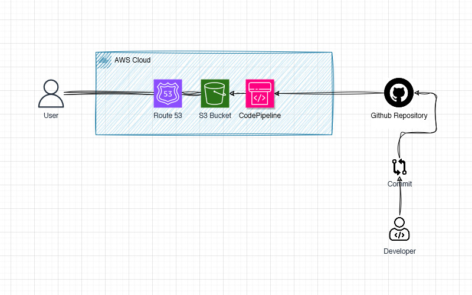

# Static Website Hosting on Amazon S3 with CI/CD Pipeline.
This project demonstrates how to host a static website on Amazon S3 and set up a Continuous Integration/Continuous Deployment (CI/CD) pipeline that automatically deploys changes from a GitHub repository to the S3 bucket whenever updates are pushed.

### Overview: Hosting a Static Website with CI/CD

I use Amazon S3 to host static website and automate deployments through GitHub and AWS CodePipeline.

Steps:

1. Amazon S3 Hosting: Host the website on Amazon S3, configuring it for static website hosting.

2. GitHub Repository: The website's code resides in a GitHub repository.

3. CI/CD Pipeline: AWS CodePipeline automatically deploys changes when I push updates to GitHub.

4. Deployment: CodePipeline fetches code changes and deploys the website to S3.

5. Custom Domain (Optional): You can set up a custom domain using Amazon Route 53.

### Diagram

